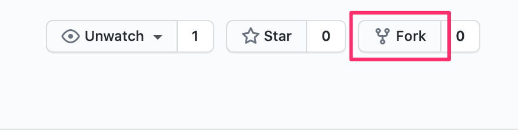
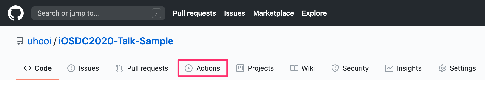

# iOSDC2020-Talk-Sample

## 概要

iOSDC 2020「GitHub ActionsでiOSアプリをCIする個人的ベストプラクティス」レギュラートーク（以下、単に「トーク」と呼ぶ）のサンプルリポジトリです。

トークはハンズオン形式です。  
本リポジトリを使って実際に手を動かすと、より楽しめます。

## 本リポジトリの使い方

本リポジトリの `main` ブランチには、ビルドが通るiOSアプリのソースのみ含まれています。  
GitHub Actionsのワークフローを作成し、みなさんの手で本リポジトリのCI環境を構築してください！

1. 本リポジトリをフォークします。  

2. 以下を参考にしてフォークしたリポジトリのワークフローを有効にします。  
https://github.com/uhooi/iOSDC2020-Article-Sample#ci

3. トークに沿って `.github/workflows/main.yml` を作成し、コミットしてプッシュします。  
自分で実装するのが手間な人は `answer` ブランチからコピペしてください。  
https://github.com/uhooi/iOSDC2020-Talk-Sample/blob/answer/.github/workflows/main.yml

4. プッシュをトリガー（きっかけ）にCIが実行されるので、「Actions」タブから結果を確認します。  
  

5. CIが成功していればOKです！

## 参考リンク

- [GitHub ActionsでiOSアプリをCIする個人的ベストプラクティス by uhooi | トーク | iOSDC Japan 2020 - fortee.jp](https://fortee.jp/iosdc-japan-2020/proposal/aff7d899-f92e-4342-ae24-fde1ae4cf799)
- [iOSDC 2020「GitHub ActionsでiOSアプリをCIする個人的ベストプラクティス」パンフレット記事の補足資料](https://gist.github.com/uhooi/4e4844e7e7f6c7ed1caca60112c1f539)
- [actions/cache: Cache dependencies and build outputs in GitHub Actions](https://github.com/actions/cache)
- [norio-nomura/action-swiftlint: GitHub Action for SwiftLint](https://github.com/norio-nomura/action-swiftlint)

## お問い合わせ

ハンズオンに行き詰まった、CIが失敗するなどの理由で問い合わせたい場合、Twitterの [@the_uhooi](https://twitter.com/the_uhooi) までご連絡ください。  
または [Discussions](https://github.com/uhooi/iOSDC2020-Talk-Sample/discussions) にご投稿ください。

## おわりに

頑張ってサンプルリポジトリを作ったので、スターください！
